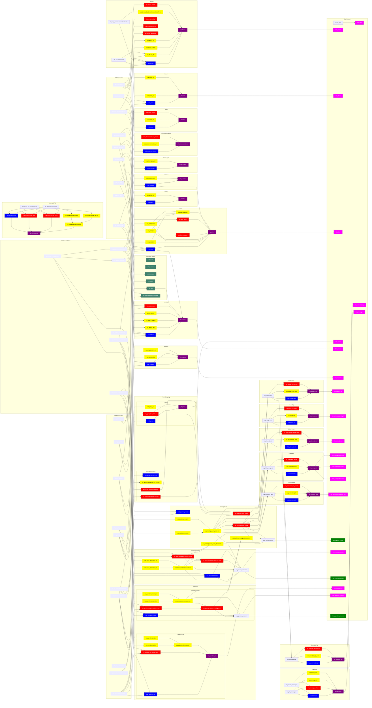

```mermaid

%% basis, bumpX, bumpY, cardinal, catmullRom, linear, monotoneX, monotoneY, natural, step, stepAfter, and stepBefore. %%
%%{ init: { 'flowchart': { 'curve': 'basis' } } }%%

graph LR
classDef yellow stroke:#FFD700,fill:#FFFF00,color:black
classDef red stroke:#8B0000,fill:#FF0000,color:white
classDef blue stroke:#000080,fill:#0000FF,color:white
classDef purple stroke:#4B0082,fill:#800080,color:white
classDef green stroke:#006400,fill:#008000,color:white
classDef magenta stroke:#8B008B,fill:#FF00FF,color:white
classDef teal stroke:#004040,fill:#008080,color:white
classDef viridian stroke:#204137,fill:#40826D,color:white
classDef harlequin stroke:#1EAA00,fill:#3FFF00,color:black
classDef grey stroke:#FFFFFF,fill:#33333,color:white

subgraph DM SQS Ingest

    dm_sqs_stack:::grey
    dm_sqs_customer
    dm_sqs_devicetype:::grey
    dm_sqs_customer:::grey
    dm_sqs_billing:::grey
    dm_sqs_fleet:::grey
    dm_sqs_vehicle:::grey
    dm_sqs_device:::grey
    dm_sqs_tablet:::grey
    dm_sqs_attachmentdevice:::grey
    dm_sqs_tablet:::grey

end

subgraph KS Derived Tables

    stg_kinesis_tracking_event:::grey
    stg_kinesis_waypoint:::grey
    stg_kinesis_vehicle_driver:::grey
    stg_kinesis_mass_declaration:::grey
    stg_kinesis_question_list:::grey
    stg_kinesis_question_answer:::grey

end

subgraph HE Extract Tables

    stg_he_fleet:::grey
    stg_he_vehicle:::grey
    stg_he_stg_setpoint:::grey
    stg_he_group:::grey
    stg_he_group_memberships:::grey
    stg_he_vehicle_notifications_t:::grey
    stg_he_mass_declaration:::grey
    stg_he_question_list:::grey
    stg_he_question_answer:::grey
    stg_driver_he:::grey

end

subgraph Reference Tables

    dm_sqs_stack --> ref_stack:::viridian
    dm_sqs_customer --> ref_customer:::viridian
    dm_sqs_devicetype --> ref_devicetype:::viridian
    dm_sqs_billing --> ref_billing:::viridian
    dm_sqs_fleet --> ref_fleet:::viridian
    stg_he_mass_declaration & stg_kinesis_mass_declaration --> ref_mass_declaration_scheme:::viridian

end

subgraph Customer

    dm_sqs_customer --> hub_customer:::blue
    dm_sqs_customer --> sat_customer_dm:::yellow

    hub_customer --> pit_customer:::purple
    sat_customer_dm --> pit_customer:::purple

end

subgraph Billing

    dm_sqs_billing --> hub_billing:::blue
    dm_sqs_billing --> sat_billing_dm:::yellow

    hub_billing --> pit_billing:::purple
    sat_billing_dm --> pit_billing:::purple

    stg_kinesis_tracking_event --> stg_kinesis_vehicle_driver

end

subgraph Fleet

    hub_fleet:::blue
    dm_sqs_vehicle --> hub_fleet
    stg_he_fleet --> hub_fleet
    dm_sqs_fleet --> hub_fleet
    stg_kinesis_vehicle_driver --> hub_fleet

    dm_sqs_fleet --> lnk_fleet_customer:::red
    dm_sqs_fleet --> lnk_fleet_billing:::red

    dm_sqs_fleet --> sat_fleet_dm:::yellow
    stg_he_fleet --> sat_fleet_he:::yellow
    stg_kinesis_vehicle_driver --> sat_fleet_kinesis:::yellow

    sat_fleet_dm & sat_fleet_he & sat_fleet_kinesis --> sat_fleet_coalesce:::yellow

    hub_fleet --> pit_fleet:::purple
    sat_fleet_dm --> pit_fleet:::purple
    sat_fleet_kinesis --> pit_fleet:::purple
    sat_fleet_he --> pit_fleet:::purple
    lnk_fleet_customer --> pit_fleet:::purple
    lnk_fleet_billing --> pit_fleet:::purple
    hub_customer --> pit_fleet:::purple
    sat_fleet_coalesce --> pit_fleet:::purple

end

subgraph Vehicle

    hub_vehicle:::blue
    dm_sqs_vehicle --> hub_vehicle
    stg_he_vehicle --> hub_vehicle
    stg_kinesis_vehicle_driver --> hub_vehicle

    lnk_vehicle_fleet:::red
    dm_sqs_vehicle --> lnk_vehicle_fleet
    stg_kinesis_vehicle_driver --> lnk_vehicle_fleet

    dm_sqs_vehicle --> sat_vehicle_dm:::yellow
    stg_he_vehicle --> sat_vehicle_he:::yellow
    stg_kinesis_vehicle_driver --> sat_vehicle_kinesis:::yellow

    pit_vehicle:::purple
    hub_vehicle --> pit_vehicle
    sat_vehicle_dm --> pit_vehicle
    sat_vehicle_kinesis --> pit_vehicle
    sat_vehicle_he --> pit_vehicle
    lnk_vehicle_fleet --> pit_vehicle
    hub_fleet --> pit_vehicle
    ref_fleet --> pit_vehicle

end

subgraph Device-Type

    dm_sqs_devicetype --> hub_devicetype:::blue
    dm_sqs_devicetype --> sat_devicetype_dm:::yellow

    hub_devicetype --> pit_devicetype:::purple
    sat_devicetype_dm --> pit_devicetype:::purple

end

subgraph Device

    dm_sqs_device --> hub_device:::blue
    dm_sqs_iotresponse --> hub_device:::blue
    dm_sqs_deviceinstanceidentifierdto --> hub_device:::blue
    dm_sqs_attachmentdevice --> hub_device:::blue

    dm_sqs_device --> lnk_device_vehicle:::red
    dm_sqs_device --> lnk_device_billing:::red
    dm_sqs_device --> lnk_device_customer:::red
    dm_sqs_device --> lnk_device_devicetype:::red

    stg_kinesis_vehicle_driver --> sat_device_kinesis:::yellow
    stg_he_vehicle --> sat_device_he:::yellow

    dm_sqs_device & dm_sqs_iotresponse--> sat_device_dm:::yellow
    dm_sqs_deviceinstanceidentifierdto --> sat_device_dm_deviceinstanceidentifierdto:::yellow

    hub_device  --> pit_device:::purple
    sat_device_dm  --> pit_device:::purple
    sat_device_kinesis  --> pit_device:::purple
    sat_device_he  --> pit_device:::purple
    sat_device_dm_deviceinstanceidentifierdto  --> pit_device:::purple
    lnk_device_vehicle  --> pit_device:::purple

end

subgraph Attachment-Device

    dm_sqs_attachmentdevice --> hub_attachmentdevice:::blue
    dm_sqs_attachmentdevice --> sat_attachmentdevice_dm:::yellow
    dm_sqs_attachmentdevice --> lnk_attachmentdevice_device:::red

    hub_attachmentdevice --> pit_attachmentdevice:::purple
    sat_attachmentdevice_dm --> pit_attachmentdevice:::purple
    lnk_attachmentdevice_device --> pit_attachmentdevice:::purple

end

subgraph Tablet

    dm_sqs_tablet --> hub_tablet:::blue
    dm_sqs_tablet --> sat_tablet_dm:::yellow
    dm_sqs_tablet --> lnk_tablet_device:::red

    hub_tablet --> pit_tablet:::purple
    sat_tablet_dm --> pit_tablet:::purple
    lnk_tablet_device --> pit_tablet:::purple

end

subgraph Scorecard-Rule

    scorecard_sqs_scorecardrules --> hub_scorecardrule:::blue
    scorecard_sqs_scorecardrules --> lnk_scorecardrule_fleet:::red
    scorecard_sqs_scorecardrules --> lnk_scorecardrule_group:::red
    scorecard_sqs_scorecardrules --> sat_scorecardrule_he_sqs:::yellow

    stg_driver_scoring_rules --> hub_scorecardrule:::blue
    stg_driver_scoring_rules --> lnk_scorecardrule_fleet:::red
    stg_driver_scoring_rules --> lnk_scorecardrule_group:::red
    stg_driver_scoring_rules --> sat_scorecardrule_he_ext:::yellow

    sat_scorecardrule_he_ext --> sat_scorecardrule_coalesce:::yellow
    sat_scorecardrule_he_sqs --> sat_scorecardrule_coalesce:::yellow

    hub_scorecardrule --> pit_scorecardrule:::purple
    lnk_scorecardrule_fleet --> pit_scorecardrule:::purple
    lnk_scorecardrule_group --> pit_scorecardrule:::purple
    sat_scorecardrule_coalesce --> pit_scorecardrule:::purple

end

subgraph Driver

    stg_kinesis_vehicle_driver --> hub_driver:::blue
    stg_kinesis_vehicle_driver --> sat_driver_ks:::yellow

    stg_driver_he --> hub_driver:::blue
    stg_driver_he --> sat_driver_he:::yellow

    hub_driver --> pit_driver:::purple
    sat_driver_he --> pit_driver:::purple
    sat_driver_ks --> pit_driver:::purple

end

subgraph Waypoint

    stg_kinesis_tracking_event --> stg_kinesis_waypoint

    stg_he_stg_setpoint --> hub_waypoint:::blue
    stg_he_stg_setpoint --> sat_waypoint_he:::yellow
    stg_kinesis_waypoint --> hub_waypoint:::blue
    stg_kinesis_waypoint --> sat_waypoint_kinesis:::yellow

    hub_waypoint --> pit_waypoint:::purple
    sat_waypoint_he --> pit_waypoint:::purple
    hub_waypoint --> pit_waypoint:::purple
    sat_waypoint_kinesis --> pit_waypoint:::purple

end


subgraph Fleet Grouping

subgraph Group

    stg_he_group --> hub_group:::blue
    stg_he_group --> sat_group_he:::yellow
    stg_he_group --> lnk_group_fleet_default:::red

    hub_group --> pit_group:::purple
    sat_group_he --> pit_group:::purple
    lnk_group_fleet_default --> pit_group:::purple

end

subgraph Group-Membership

    stg_he_group_memberships --> hub_group_membership:::blue
    stg_he_group_memberships --> sat_group_membership_he_manual:::yellow
    stg_he_group_memberships --> lnk_group_membership_vehicle:::red
    stg_he_group_memberships --> lnk_group_membership_driver:::red

end

end


subgraph Tracking-Event

    stg_he_vehicle_notifications_t --> hub_tracking_event:::blue
    stg_he_vehicle_notifications_t --> sat_tracking_event_he:::yellow

    stg_kinesis_tracking_event --> hub_tracking_event:::blue
    stg_kinesis_tracking_event --> sat_tracking_event_ks:::yellow

    sat_tracking_event_ks --> sat_tracking_event_coalesce:::yellow
    sat_tracking_event_he --> sat_tracking_event_coalesce:::yellow

    sat_tracking_event_coalesce --> lnk_tracking_event_vehicle:::red

    sat_tracking_event_coalesce --> lnk_tracking_event_group:::red
    lnk_group_fleet_default --> lnk_tracking_event_group:::red
    lnk_group_membership_vehicle --> lnk_tracking_event_group:::red
    lnk_group_membership_driver --> lnk_tracking_event_group:::red

    lnk_tracking_event_vehicle & sat_tracking_event_coalesce --> bdg_tracking_event

    sat_tracking_event_question_answer --> bdg_tracking_event
    sat_tracking_event_mass_declaration --> bdg_tracking_event

end

subgraph Driver-Trip

    sat_tracking_event_coalesce --> stg_driver_trip
    lnk_tracking_event_vehicle -->  stg_driver_trip

    stg_driver_trip --> hub_driver_trip:::blue
    stg_driver_trip --> sat_driver_trip:::yellow
    stg_driver_trip --> lnk_driver_trip_driver:::red

    hub_driver_trip --> pit_driver_trip:::purple
    sat_driver_trip --> pit_driver_trip:::purple
    lnk_driver_trip_driver --> pit_driver_trip:::purple

end

subgraph Ignition-Trip

    sat_tracking_event_coalesce --> stg_ignition_trip
    lnk_tracking_event_vehicle -->  stg_ignition_trip

    stg_ignition_trip --> hub_ignition_trip:::blue
    stg_ignition_trip --> sat_ignition_trip_main:::yellow
    stg_ignition_trip --> lnk_ignition_trip_vehicle:::red

    hub_ignition_trip --> pit_ignition_trip:::purple
    sat_ignition_trip_main --> pit_ignition_trip:::purple
    lnk_ignition_trip_vehicle --> pit_ignition_trip:::purple

end

subgraph Extended-Trip

    stg_ignition_trip --> stg_extended_trip
    stg_driver_trip --> stg_extended_trip

    stg_extended_trip --> hub_extended_trip:::blue
    stg_extended_trip --> sat_extended_trip_main:::yellow
    stg_extended_trip --> lnk_extended_trip_vehicle:::red

    hub_extended_trip --> pit_extended_trip:::purple
    sat_extended_trip_main --> pit_extended_trip:::purple
    lnk_extended_trip_vehicle -->  pit_extended_trip:::purple

end

subgraph Overspeed

    sat_tracking_event_coalesce --> stg_hub_overspeed
    lnk_tracking_event_vehicle --> stg_hub_overspeed

    stg_hub_overspeed --> hub_overspeed:::blue
    stg_hub_overspeed --> sat_overspeed_main:::yellow
    stg_hub_overspeed --> lnk_overspeed_vehicle:::red

    hub_overspeed --> pit_overspeed:::purple
    sat_overspeed_main --> pit_overspeed:::purple
    lnk_overspeed_vehicle --> pit_overspeed:::purple

end

subgraph Driver-Break

    sat_tracking_event_coalesce --> stg_driver_break
    lnk_tracking_event_vehicle --> stg_driver_break

    stg_driver_break --> hub_driver_break:::blue
    stg_driver_break --> sat_driver_break_main:::yellow
    stg_driver_break --> lnk_driver_break_vehicle_driver:::red

    pit_driver_break:::purple
    hub_driver_break --> pit_driver_break
    sat_driver_break_main --> pit_driver_break
    lnk_driver_break_vehicle_driver --> pit_driver_break

end

subgraph Excessive-Idle

    sat_tracking_event_coalesce --> stg_excessive_idle
    lnk_tracking_event_vehicle --> stg_excessive_idle

    stg_excessive_idle --> hub_excessive_idle:::blue
    stg_excessive_idle --> sat_excessive_idle:::yellow
    stg_excessive_idle --> lnk_excessive_idle_vehicle:::red

    hub_excessive_idle & sat_excessive_idle & lnk_excessive_idle_vehicle --> pit_excessive_idle:::purple

end

subgraph Message

    stg_he_messages --> hub_message:::blue
    stg_he_messages --> sat_message_he:::yellow
    stg_he_messages --> lnk_message_vehicle:::red

    stg_kinesis_messages --> hub_message:::blue
    stg_kinesis_messages --> sat_message_ks:::yellow
    stg_kinesis_messages --> lnk_message_vehicle:::red

    hub_message & lnk_message_vehicle & sat_message_he & sat_message_ks --> pit_messages:::purple

end


subgraph Mass-Declaration

    stg_he_mass_declaration --> hub_mass_declaration:::blue
    stg_he_mass_declaration --> sat_mass_declaration_he:::yellow
    stg_he_mass_declaration --> lnk_mass_declaration_vehicle_driver:::red

    stg_kinesis_mass_declaration --> hub_mass_declaration:::blue
    stg_kinesis_mass_declaration --> sat_mass_declaration_ks:::yellow
    stg_kinesis_mass_declaration --> lnk_mass_declaration_vehicle_driver:::red

    sat_mass_declaration_he & sat_mass_declaration_ks --> sat_mass_declaration_coalesce:::yellow

    hub_mass_declaration --> brg_mass_declaration
    sat_mass_declaration_coalesce --> brg_mass_declaration
    lnk_mass_declaration_vehicle_driver --> brg_mass_declaration

    lnk_mass_declaration_vehicle_driver & sat_mass_declaration_coalesce --> lnk_mass_declaration_tracking_event:::red

    lnk_mass_declaration_tracking_event & hub_mass_declaration & sat_tracking_event_mass_declaration --> brg_mass_declaration

    lnk_mass_declaration_vehicle_driver & sat_mass_declaration_coalesce --> sat_tracking_event_mass_declaration:::yellow

end

subgraph Questions

subgraph Question-List

    stg_he_question_answer --> hub_question_list:::blue
    stg_he_question_answer --> sat_question_list_he:::yellow
    stg_he_question_answer --> lnk_question_list_vehicle_driver:::red

    stg_kinesis_question_answer --> hub_question_list:::blue
    stg_kinesis_question_answer --> sat_question_list_ks:::yellow
    stg_kinesis_question_answer --> lnk_question_list_vehicle_driver:::red

    sat_question_list_he & sat_question_list_ks --> sat_question_list_coalesce:::yellow

    hub_question_list & lnk_question_list_vehicle_driver & sat_question_list_coalesce --> pit_question_list:::purple

end

subgraph Question-Answer

    stg_he_question_answer --> hub_question_answer:::blue
    stg_he_question_answer --> sat_question_answer_he:::yellow
    stg_he_question_answer --> lnk_question_answer_vehicle_driver:::red

    stg_kinesis_question_answer --> hub_question_answer:::blue
    stg_kinesis_question_answer --> sat_question_answer_ks:::yellow
    stg_kinesis_question_answer --> lnk_question_answer_vehicle_driver:::red

    sat_question_answer_he & sat_question_answer_ks --> sat_question_answer_coalesce:::yellow

    lnk_question_answer_vehicle_driver & sat_question_answer_coalesce --> lnk_question_answer_tracking_event:::red

    lnk_question_answer_tracking_event & hub_question_answer & sat_question_answer_coalesce --> brg_question_answers
    lnk_question_answer_tracking_event & sat_question_answer_coalesce --> sat_tracking_event_question_answer:::yellow

end

end

subgraph Star Schema

    as_of_dt_v --> dim_date:::magenta
    pit_device --> dim_device:::magenta
    pit_driver --> dim_driver:::magenta
    pit_fleet --> dim_fleet:::magenta
    pit_group --> dim_group:::magenta
    pit_vehicle --> dim_vehicle:::magenta
    pit_waypoint --> dim_waypoint:::magenta
    pit_ignition_trip --> dim_ignition_trip:::magenta
    pit_driver_trip --> dim_driver_logon_logoff:::magenta
    pit_extended_trip --> dim_extended_trip:::magenta
    pit_driver_break --> dim_driver_break:::magenta
    pit_overspeed --> dim_overspeed_zone_1:::magenta
    pit_overspeed --> dim_overspeed_zone_2:::magenta
    pit_overspeed --> dim_overspeed_zone_3:::magenta
    pit_excessive_idle --> dim_excessive_excessive_idle:::magenta
    pit_messages --> dim_messages:::magenta

    bdg_tracking_event --> fact_tracking_events:::green

    brg_mass_declaration --> dim_mass_declaration:::magenta
    brg_mass_declaration --> fact_mass_declaration:::green

    pit_question_list --> dim_question_list:::magenta
    brg_question_answers --> dim_question_answers:::magenta
    brg_question_answers --> fact_question_answers:::green

end

```
